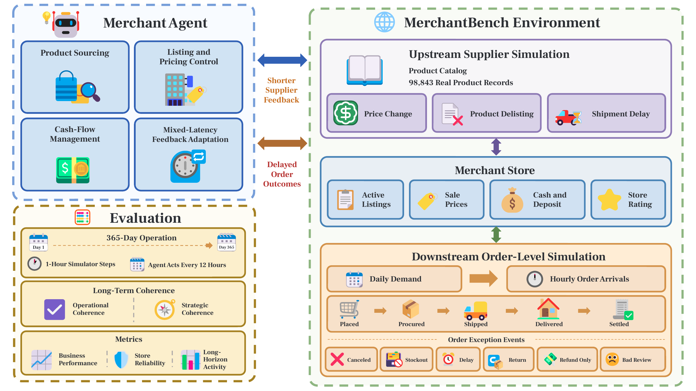

# MerchantBench: Benchmarking LLM Agents for Long-Term Coherence in E-Commerce Operations


<p align="center">
  <a href="https://www.1688.com/"></a>
  &nbsp;&nbsp;&nbsp;
  
  &nbsp;&nbsp;&nbsp;
  <a href="https://www.zju.edu.cn/english/"></a>
</p>

<p align="center">
  <strong>Alibaba Group · 1688 × Zhejiang University</strong>
</p>

<p align="center">
  <a href="https://arxiv.org/abs/2607.28956"></a>
  <a href="https://air.1688.com/kapp/next1688/merchantbench/?spm=defwork.home.0.0.7f8c530dSdRT9v"></a>
</p>

<p align="center">
  <a href="https://huggingface.co/papers/2607.28956" target="_blank" rel="noopener noreferrer"></a>
</p>


## Introduction

MerchantBench places an agent in charge of a persistent online store, where it
must source products, manage listings and prices, control cash flow, and adapt
to changing market conditions over **365 simulated days**. The environment couples
**promptly observable supplier changes with delayed order outcomes**, so decisions
**must remain coherent as evidence accumulates across a long operating horizon**.

This repository contains the simulator, agent SDK and reference baselines,
evaluation harness, batch runner, and test suite. Credentials, local run
records, private source-system connectors, and non-redistributable datasets are
intentionally excluded.

📰 **MerchantBench in the news.** See coverage on
  [WeChat (智猩猩AI)](https://mp.weixin.qq.com/s/mZB1tls0iY-sy7e_M5jJBQ),
  [X (AK)](https://x.com/i/status/2085048994976124988),
  [X (DAIR.AI)](https://x.com/i/status/2084413007514550720), and
  [X (DailyPapers)](https://x.com/i/status/2085161497781813581).

## News
- **[2026-08-05]** 🏆 **#1 Paper of the Day.** MerchantBench ranked **#1** on
  [🤗 Hugging Face Daily Papers](https://huggingface.co/papers/2607.28956)!
- **[2026-08-03]** 📄 **Paper available.** The MerchantBench paper is now available on
  [arXiv](https://arxiv.org/abs/2607.28956).
- **[2026-08-03]** 🚀 **Project homepage.** Visit the
  [MerchantBench project homepage](https://air.1688.com/kapp/next1688/merchantbench/?spm=defwork.home.0.0.7f8c530dSdRT9v)
  for more information.

## Overview



*MerchantBench combines an upstream supplier simulation, a merchant store, and
a downstream order-level simulation to evaluate long-term coherence over 365
simulated days.*

## Key Features

- **Long-horizon agent evaluation.** MerchantBench evaluates whether an agent
  can sustain and revise a goal-directed merchant policy throughout a 365-day
  operation, rather than complete a bounded task.
- **Upstream and downstream simulation.** The environment connects upstream
  supplier events with downstream order outcomes that become observable at
  different delays, testing how agents adapt earlier decisions to new evidence.
- **Order-level dynamics.** Demand is instantiated as individual orders that
  progress through procurement, fulfillment, delivery, settlement, and
  after-sales outcomes, exposing the delayed operational and financial effects
  of agent decisions.

## Artifact contents

| Path | Contents |
| --- | --- |
| `env/` | Flask simulator, benchmark tools, dashboard, and scenarios |
| `agent/` | HTTP SDK, reference baselines, and submission template |
| `eval/` | Docker-based evaluation harness and scoring |
| `scripts/run_batch.py` | Repeated/model-sweep experiment launcher |
| `tests/` | Public synthetic-data test suite |

> **Data availability.** This repository provides a synthetic-data generator;
> real-world business data is not included. The default scenario generates a
> deterministic synthetic catalog with 1,000 products and 200 suppliers.
> For inquiries about testing with real-world business data, please contact
> [taoyulong.tyl@taobao.com](mailto:taoyulong.tyl@taobao.com).

## Requirements

- Python 3.10 or newer (Python 3.11 recommended)
- Docker, only for containerized evaluation
- An OpenAI-compatible API key, only for the LLM-driven ReAct baseline

## Install and verify

Run these commands from the extracted archive root:

```bash
python3.11 -m venv .venv
.venv/bin/python -m pip install --upgrade pip
.venv/bin/python -m pip install -r requirements.txt

PYTHONPATH=env:agent .venv/bin/python -m pytest tests/
```

The deterministic rule-based baseline and the simulator tests do not require
an API key.

## Quick start

Start the simulator:

```bash
cd env
../.venv/bin/python run.py --port 5050
```

Open `http://127.0.0.1:5050/new_run` and select either:

- `human` for the browser playground; or
- `rule_based` for a deterministic, API-key-free reference agent.

The dashboard is available at `http://127.0.0.1:5050/`.

To run an external baseline instead, create a run from the dashboard or API,
then use the returned run ID:

```bash
.venv/bin/python agent/baselines/rule_based.py \
  --selection-mode random \
  --selection-seed 42 \
  --run-id RUN_ID \
  --base-url http://127.0.0.1:5050
```

## LLM-driven baseline

Copy the environment template and provide credentials for an
OpenAI-compatible endpoint:

```bash
cp .env.example .env
```

Then run:

```bash
.venv/bin/python agent/baselines/react_160k_compact_30k.py \
  --run-id RUN_ID \
  --base-url http://127.0.0.1:5050
```

Credentials are read at runtime and must not be embedded in an agent image.

## Batch experiments

Edit `scripts/batch_queue.yaml`, start the simulator, and run:

```bash
.venv/bin/python scripts/run_batch.py --queue scripts/batch_queue.yaml
```

The default queue file is an API-key-free rule-based smoke configuration.
Change `bootstrap_agent` and model entries when reproducing LLM experiments.

## Containerized evaluation

```bash
docker build -f agent/submission_template/Dockerfile \
  -t merchantbench-agent:artifact agent/

docker build -f eval/env_image/Dockerfile \
  -t merchantbench-env:artifact env/

.venv/bin/python -m eval.run_eval \
  --agent-image merchantbench-agent:artifact \
  --env-image merchantbench-env:artifact \
  --output result.json
```

See `agent/README.md`, `env/README.md`, and `eval/OPERATOR.md` for the protocol,
runtime state, and evaluation details.

## Generated files

Runtime state is written under `env/runs/`. Test caches, virtual environments,
credentials, run records, SQLite databases, and result files should not be
added to a redistributed archive.

## Citation

```bibtex
@misc{shi2026merchantbench,
  title         = {MerchantBench: Benchmarking LLM Agents for Long-Term Coherence in E-Commerce Operations},
  author        = {Qiming Shi and Yulong Tao and Linbo Jin and Zhaolu Kang and Yibo Dou and Jiawen Zhu and Tianjun Pan and Shaokang Fu and Chengyu Wang and Siyue Li and Yaping Cheng and Di Weng and Chengfu Huo},
  year          = {2026},
  eprint        = {2607.28956},
  archivePrefix = {arXiv},
  primaryClass  = {cs.AI},
  url           = {https://arxiv.org/abs/2607.28956}
}
```
